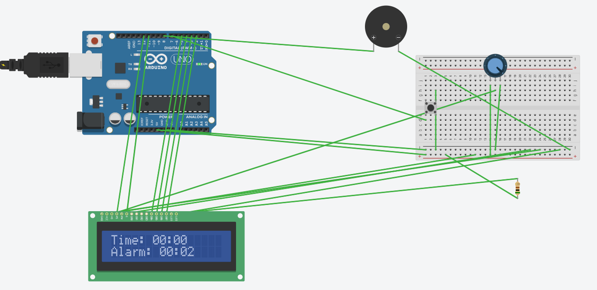

# Arduino Alarm Clock

A simple alarm clock built with an Arduino, LCD, and buzzer.  
The project demonstrates the use of **sensors (button)** and **actuators (LCD + buzzer)**.

---

## Features
- Displays the current time (hours and minutes) on a 16x2 LCD.
- Hardcoded alarm time (set in code).
- Buzzer rings when the alarm time is reached.
- Push button can stop the alarm ringing.
- Demonstrates **sensor → actuator interaction**:
  - **Sensor:** push button
  - **Actuators:** buzzer + LCD
---

## Circuit Wiring
- **LCD:** RS → 12, E → 11, D4 → 5, D5 → 4, D6 → 3, D7 → 2  
- **Buzzer:** pin 8 → positive leg, GND → negative leg  
- **Button:** pin 7 → one leg, other leg → GND (using `INPUT_PULLUP`)  
- **LCD Power:** VCC → 5V, GND → GND  

---

## How It Works
1. The Arduino keeps time using the `millis()` function.
2. The LCD shows the current time and the alarm setting.
3. When the set alarm time matches the clock, the buzzer turns on.
4. The push button can stop the buzzer by disabling the alarm.

---

## Future Improvements
1. To be able to set time and alarm with buttons
