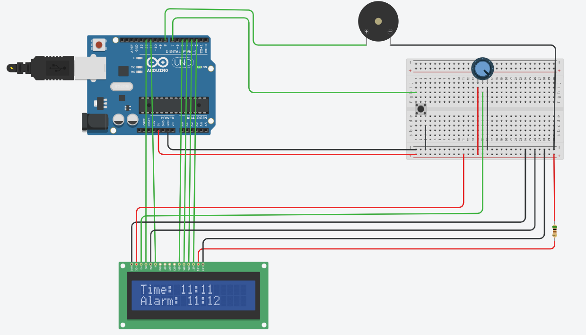

# Arduino Alarm Clock

A simple alarm clock built with an Arduino, LCD, and buzzer.  
The project demonstrates the use of sensors (button) and actuators (LCD and buzzer).

---

---

## Features
Displays the current time (hours and minutes) on LCD screen.
Hardcoded alarm time (set in code).
Buzzer rings when the alarm time is reached.
Push button can stop the alarm ringing.
Sensor: pushbutton
Actuators: buzzer and LCD screen
---

# To wire your LCD screen to your board, connect the following pins:
LCD RS pin to digital pin 12.
LCD Enable pin to digital pin 11.
LCD D4 pin to digital pin 5.
LCD D5 pin to digital pin 4.
LCD D6 pin to digital pin 3.
LCD D7 pin to digital pin 2.
LCD R/W pin to GND.
LCD VSS pin to GND.
---

## How It Works
1. The Arduino keeps time using the `millis()` function.
2. The LCD shows the current time and the alarm setting.
3. When the set alarm time matches the clock, the buzzer turns on.
4. The push button can stop the buzzer by disabling the alarm.

---

## Future Improvements
- To be able to set time and alarm with buttons
